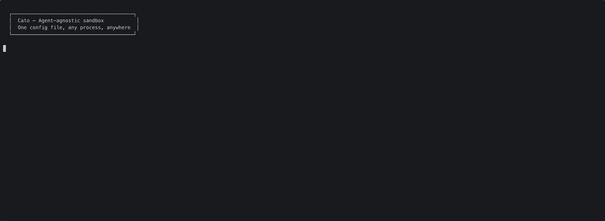
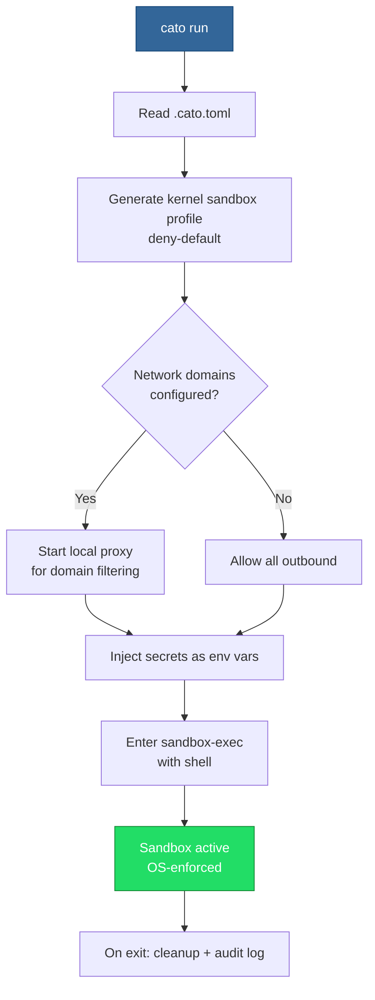
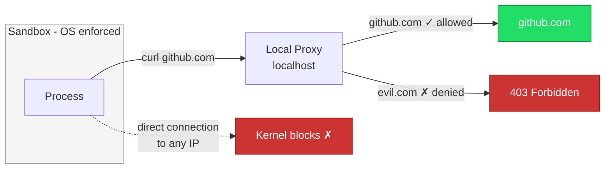

<p align="center">
  <h1 align="center">Cato</h1>
  <p align="center">Portable sandbox for AI agents and untrusted commands.<br/>One config, any process, anywhere.</p>
  <p align="center"><strong>Research Preview</strong> — macOS + Linux. Feedback welcome.</p>
  <p align="center">
    <a href="https://github.com/Harikrishnareddyl/cato/actions/workflows/ci.yml"></a>
    <a href="https://github.com/Harikrishnareddyl/cato/releases/latest"></a>
    <a href="https://crates.io/crates/cato-cli"></a>
    <a href="https://www.npmjs.com/package/cato-cli"></a>
    <a href="https://pypi.org/project/cato-cli-py/"></a>
    <a href="https://github.com/Harikrishnareddyl/cato/blob/main/LICENSE"></a>
  </p>
</p>

---

<p align="center">
  
</p>

> **Research Preview.** macOS (Apple Silicon + Intel) and Linux (Ubuntu 22.04+, Debian 12+, Fedora 36+). [Feedback and issues](https://github.com/Harikrishnareddyl/cato/issues) appreciated.

## The problem

AI agents run with your full permissions — every file, every secret, every network endpoint. So do build scripts, npm packages, and downloaded code. You either set up Docker (heavy) or trust everything (risky).

## What Cato does

A `.cato.toml` in your repo defines what any process can access — which files are readable, which are writable, which network domains are reachable. Cato enforces it as an OS-level sandbox. No containers, no daemon, under 2 MB.

```toml
# .cato.toml — commit to git, same rules everywhere
[sandbox]
allow_write = ["{workspace}", "/tmp"]
deny_read = ["*.env", "*.key", "*.pem"]
network = ["github.com", "registry.npmjs.org"]
```

```bash
cato run
```

```
🔒 my-project $ cat .env              → Operation not permitted
🔒 my-project $ curl https://evil.com → blocked
🔒 my-project $ ls ~/Documents        → invisible
🔒 my-project $ echo $API_KEY         → available (injected as env var)
🔒 my-project $ node app.js           → works fine
```

## Why Cato

**Works with any agent, any tool.** Same `.cato.toml` for Claude, Codex, Cursor, or a shell script. Switch agents without reconfiguring security. The sandbox doesn't care what's inside.

**Granular file-level control.** Not just "this directory is mounted" — you define which file patterns are blocked from reading (`*.env`, `*.key`, `*credentials*`) and which are blocked from writing (`*.lock`, `.github/*`). Enforced at the OS level.

**Network domain filtering.** Not "network on or off" — you list exactly which domains are reachable. Everything else is blocked. `npm install` works, `curl evil.com` doesn't.

**Portable.** The `.cato.toml` lives in your repo, checked into git. Every developer, every CI runner, every container gets the same boundaries. No per-machine setup.

**Zero overhead.** Single binary, under 2 MB. Sub-second startup. No daemon, no runtime, no container images, no root access. Works directly on your machine.

## Use cases

**Run AI agents with real boundaries:**
```bash
cato run -- claude -p "refactor the auth module"
# Agent can read and write your code, but can't read .env,
# can't access ~/Documents, can't reach unauthorized APIs
# Same rules whether it's Claude, Codex, Cursor, or a custom agent
```
Setup required for agents — see [use case guides](docs/use-cases/).

**Protect secrets from build scripts and dependencies:**
```bash
cato run -- npm install
# Postinstall scripts run normally but can't read .env, ~/.ssh, or any secret files
```

**Same security rules everywhere — local, CI, containers:**
```bash
# .cato.toml is in git — every environment gets the same rules
git clone repo && cd repo && cato run -- npm test    # local
cato run -- npm test                                  # CI
# Inside Docker: CMD ["cato", "run", "--", "node", "app.js"]
```

**Isolate secrets between projects:**
```bash
cd project-a && cato run    # only project-a's API keys available
cd project-b && cato run    # only project-b's API keys available
```

**Add granular security inside containers:**
```bash
# Containers isolate the environment. Cato adds per-file, per-domain rules inside it.
# Docker can't say "block *.env but allow *.js" — Cato can.
RUN npm install -g cato-cli
CMD ["cato", "run", "--", "node", "app.js"]
```

## Install

```bash
brew tap harikrishnareddyl/cato && brew install cato   # macOS (Homebrew)
npm install -g cato-cli                                 # Node.js
pip install cato-cli-py                                 # Python
cargo install cato-cli                                  # Rust
```

Pre-built binaries on [Releases](https://github.com/Harikrishnareddyl/cato/releases/latest).

## Quick start

```bash
cd my-project
cato init                        # creates .cato.toml
cato tool add node git python3   # register tools (once per machine)
cato run                         # enter sandbox
```

That's it for simple tools. Everything inside the sandbox follows the rules in `.cato.toml`.

### Tools that need authentication or network

Some tools (AI agents, CLIs with API access) need auth configs and network access to work inside the sandbox. For these, additional setup is needed:

```bash
cato tool add claude                    # auto-detects config dirs (~/.claude, etc.)
cato secret put CLAUDE_CODE_OAUTH_TOKEN # store auth token
# Edit .cato.toml → add required network domains
cato run -- claude "review this code"   # works
```

Each tool has different requirements. See [docs/tools/](docs/tools/) for step-by-step guides:
- [Claude Code](docs/tools/claude-code.md)
- [GitHub CLI](docs/tools/github-cli.md)

The pattern is always the same: register the tool, mount its config, add its auth, configure its network domains.

## Configuration

```toml
# .cato.toml — commit to git, same rules for everyone

[sandbox]
# Write: deny by default. Only these paths are writable.
allow_write = ["{workspace}", "/tmp"]

# Write deny: block writes to these patterns even within allow_write.
deny_write = ["*.lock", ".github/*"]

# Read deny: block reads for these patterns.
deny_read = [
    "*.env", "*.env.*",
    "*.pem", "*.key", "*.p12",
    "id_rsa", "id_ed25519",
    "*credentials*",
]

# Host paths: mount specific host directories into the sandbox.
# Used for tool configs that need auth (e.g., ~/.claude for OAuth tokens).
# Mounted read-write so tools can update their own state.
allow_read = [
    "~/.claude",
    "~/.config/gh",
]

# Network: deny by default. Only listed domains reachable.
# Empty = no outbound. ["*"] = unrestricted.
network = [
    "github.com",
    "registry.npmjs.org",
]

tools = ["node", "git", "npm"]

[sandbox.secrets]
API_KEY = {}
DATABASE_URL = { default = "postgres://localhost/mydb" }

[sandbox.options]
# ssh_agent = true  # enable if you need git push via SSH (forwards your keys)
allow_localhost = true
# log_level = "normal"  # quiet(0) | normal(1) | verbose(2) | debug(3)
```

| Field | What it does |
|-------|-------------|
| `allow_write` | Paths where writes are allowed. Everything else is read-only or invisible. |
| `deny_write` | Patterns blocked from writing even within `allow_write` paths. Deny overrides allow. |
| `deny_read` | File patterns blocked from reading. Kernel-enforced on macOS. Kernel for existing files + libc-level for new files on Linux. |
| `allow_read` | Host directories mounted into the sandbox. For tool configs that need auth. |
| `network` | Allowed domains. Empty = blocked. `["*"]` = unrestricted. |
| `tools` | Required tool binaries. |
| `secrets` | Injected as env vars. Never exist as files inside. |
| `ssh_agent` | Forward SSH agent for git push (disabled by default — forwards your keys). |
| `allow_localhost` | Allow localhost connections (dev servers, databases). |
| `log_level` | `quiet`(0), `normal`(1), `verbose`(2), `debug`(3). Default: `normal`. Override: `CATO_LOG=verbose`. |

## How it works



Uses macOS Seatbelt (`sandbox-exec`) — the same kernel framework that sandboxes App Store apps. Deny-default: everything blocked unless explicitly allowed.

### Network filtering



When domains are configured, the kernel blocks all outbound except localhost. A local proxy on localhost only forwards to allowed domains. Even if a process ignores proxy env vars, direct internet access is kernel-blocked.

### Secret protection

`deny_read` patterns are enforced at the kernel level. `cat .env` returns "Operation not permitted" — no Python trick, shell escape, or symlink attack can bypass it.

## What's enforced

| Layer | Default | macOS | Linux |
|-------|---------|-------|-------|
| Writes | Denied everywhere | Kernel (Seatbelt) | Kernel (mount namespace) |
| Reads | Allowed (workspace + system) | Kernel (Seatbelt) | Kernel for existing files, libc-level for new files* |
| Network | Denied (no outbound) | Kernel + proxy | Kernel (`--unshare-net`) + proxy |
| Home directory | Invisible | Kernel | Kernel (tmpfs) |
| Config | Write-protected | Kernel | Kernel (ro-bind) |

*On Linux, `deny_read` for files created during a session is enforced via LD_PRELOAD (catches Python, Node, shell, most tools). Go binaries and raw syscalls bypass it. See [security model](docs/security.md) for details.

## CLI

| Command | Description |
|---------|-------------|
| `cato init` | Create `.cato.toml` with sensible defaults |
| `cato run` | Enter sandboxed shell |
| `cato run -- <cmd>` | Run single command in sandbox |
| `cato run --ephemeral` | Disposable workspace copy |
| `cato tool add <name>` | Register a tool binary |
| `cato secret put <NAME>` | Store a secret |
| `cato secret put <N> --project` | Project-scoped secret |
| `cato status` | Show sandbox readiness |
| `cato audit` | View event log (per-project) |

## Architecture


## Platform support

| Platform | Status | Requirements |
|----------|--------|-------------|
| macOS (Apple Silicon) | Supported | macOS 12+ |
| macOS (Intel) | Supported | macOS 12+ |
| Linux (x64, ARM64) | Supported | Ubuntu 22.04+, Debian 12+, Fedora 36+. Requires `bubblewrap` and `socat`. |
| Windows | Not supported | |

## Building from source

```bash
git clone https://github.com/Harikrishnareddyl/cato.git
cd cato
cargo build --release
./target/release/cato --help
```

## Contributing

PRs welcome. Run `cargo test` before submitting. See [CONTRIBUTING.md](CONTRIBUTING.md).

## License

[MIT](LICENSE)
