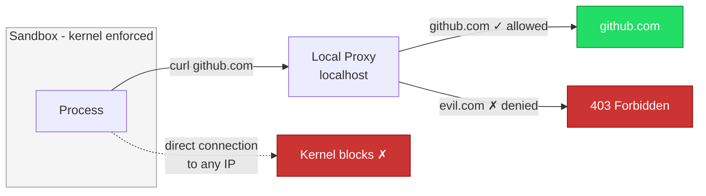
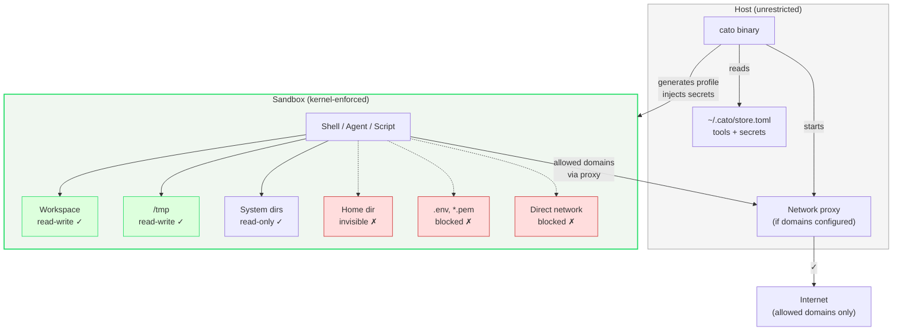

<p align="center">
  <h1 align="center">Cato</h1>
  <p align="center">Agent-agnostic sandbox. One config file, any process, anywhere.</p>
  <p align="center"><strong>Research Preview</strong> — macOS + Linux. Feedback welcome.</p>
  <p align="center">
    <a href="https://github.com/Harikrishnareddyl/cato/actions/workflows/ci.yml"></a>
    <a href="https://github.com/Harikrishnareddyl/cato/releases/latest"></a>
    <a href="https://crates.io/crates/cato-cli"></a>
    <a href="https://www.npmjs.com/package/cato-cli"></a>
    <a href="https://pypi.org/project/cato-cli-py/"></a>
    <a href="https://github.com/Harikrishnareddyl/cato/blob/main/LICENSE"></a>
  </p>
</p>

---

> **Research Preview.** Early release exploring portable, provider-independent sandboxing for development workflows. macOS (Apple Silicon + Intel) and Linux (Ubuntu 22.04+, Debian 12+, Fedora 36+). [Feedback and issues](https://github.com/Harikrishnareddyl/cato/issues) appreciated.

## The problem

AI agents are becoming the primary way developers write code. Each agent provider has its own sandbox approach — different configs, different formats, different tools. Switch agents, redo your security setup. Use multiple agents, manage multiple boundary systems.

Beyond agents: build scripts, npm packages, downloaded code — anything you run has your full permissions. You either set up Docker (heavy) or trust everything (risky).

## What Cato does

One config file. Any process. Kernel-enforced boundaries.

```bash
cd my-project
cato run
```

```
🔒 $ cat .env              → Operation not permitted
🔒 $ curl https://evil.com → blocked
🔒 $ ls ~/Documents        → invisible
🔒 $ echo $API_KEY         → available (injected)
🔒 $ node app.js           → works fine
```

The `.cato.toml` defines what's allowed. The OS kernel enforces it. Doesn't matter what's inside — Claude, Codex, Cursor, a bash script, a human. Same rules, same enforcement.

## Why this approach

Today, session-level sandboxing exists — but it's fragmented. Each tool has its own:

- Codex has `.codex/config.toml` (works only with Codex)
- Claude Code has `.claude/settings.json` (works only with Claude)
- Cloud sandboxes (E2B, Modal, Daytona) require their infrastructure
- SandVault requires macOS user account setup

If you use multiple agents, or switch between them, or want your rules to work in CI and containers too — you're managing multiple systems.

Cato's approach: **one config that works with anything, anywhere.**

| | Provider-specific configs | Cloud sandboxes | Cato |
|---|---|---|---|
| Works with any agent | No | Partially | Yes |
| Works locally | Yes | No (cloud) | Yes |
| Works in containers | N/A | N/A (is the container) | Yes |
| Works in CI | Varies | Requires setup | Yes |
| Config travels with repo | Yes (per-provider) | No | Yes |
| No platform dependency | No (tied to one agent) | No (their infra) | Yes |

## Use cases

**Run any AI agent with boundaries:**
```bash
cato run -- claude "refactor the auth system"
cato run -- codex "add tests for the API"
cato run -- node my-custom-agent.js
# Same .cato.toml, same rules, regardless of agent
```

**Protect against malicious dependencies:**
```bash
cato run -- npm install
# Postinstall scripts can't read ~/.ssh or exfiltrate data
```

**Isolate secrets between projects:**
```bash
cd project-a && cato run    # gets only project-a's secrets
cd project-b && cato run    # gets only project-b's secrets
```

**Restrict network access:**
```bash
# .cato.toml: network = ["registry.npmjs.org", "github.com"]
cato run -- npm test
# Nothing reaches production APIs or unknown servers
```

**Portable team rules:**
```bash
# .cato.toml is in git — new team member gets same boundaries instantly
git clone repo && cd repo && cato run
```

## Works anywhere

Cato is a layer, not infrastructure. Add it to any environment:

```bash
# Locally
cato run -- claude "fix the tests"

# In CI
- run: cato init --minimal && cato run -- npm test

# Inside any container (Docker, E2B, Modal, etc.)
RUN npm install -g cato-cli
CMD ["cato", "run", "--", "node", "agent.js"]
```

Same `.cato.toml`, same enforcement, regardless of where it runs.

## Install

```bash
brew tap harikrishnareddyl/cato && brew install cato   # macOS (Homebrew)
npm install -g cato-cli                                 # Node.js
pip install cato-cli-py                                 # Python
cargo install cato-cli                                  # Rust
```

Pre-built binaries on [Releases](https://github.com/Harikrishnareddyl/cato/releases/latest).

## Quick start

```bash
cd my-project
cato init                        # creates .cato.toml
cato tool add node git python3   # register tools (once per machine)
cato secret put API_KEY          # store secrets (once per machine)
cato run                         # enter sandbox
```

## Configuration

```toml
# .cato.toml — commit to git, same rules for everyone

[sandbox]
# Write: deny by default. Only these paths are writable.
allow_write = ["{workspace}", "/tmp"]

# Write deny: block writes to these patterns even within allow_write.
deny_write = ["*.lock", ".github/*"]

# Read deny: block reads for these patterns. Kernel-enforced.
deny_read = [
    "*.env", "*.env.*",
    "*.pem", "*.key", "*.p12",
    "id_rsa", "id_ed25519",
    "*credentials*",
]

# Network: deny by default. Only listed domains reachable.
# Empty = no outbound. ["*"] = unrestricted.
network = [
    "github.com",
    "api.anthropic.com",
    "registry.npmjs.org",
]

tools = ["node", "git", "npm"]

[sandbox.secrets]
API_KEY = {}
DATABASE_URL = { default = "postgres://localhost/mydb" }

[sandbox.options]
ssh_agent = true
allow_localhost = true
```

| Field | What it does |
|-------|-------------|
| `allow_write` | Paths where writes are allowed. Everything else is read-only or invisible. |
| `deny_write` | Patterns blocked from writing even within `allow_write` paths. Deny overrides allow. |
| `deny_read` | File patterns blocked from reading — kernel-enforced, can't be bypassed. |
| `network` | Allowed domains. Empty = blocked. `["*"]` = unrestricted. |
| `tools` | Required tool binaries. |
| `secrets` | Injected as env vars. Never exist as files inside. |
| `ssh_agent` | Forward SSH agent for git push. |
| `allow_localhost` | Allow localhost connections (dev servers, databases). |

## How it works


Uses macOS Seatbelt (`sandbox-exec`) — the same kernel framework that sandboxes App Store apps. Deny-default: everything blocked unless explicitly allowed.

### Network filtering



When domains are configured, the kernel blocks all outbound except localhost. A local proxy on localhost only forwards to allowed domains. Even if a process ignores proxy env vars, direct internet access is kernel-blocked.

### Secret protection

`deny_read` patterns are enforced at the kernel level. `cat .env` returns "Operation not permitted" — no Python trick, shell escape, or symlink attack can bypass it.

## What's enforced

| Layer | Default | Mechanism |
|-------|---------|-----------|
| Writes | Denied everywhere | `allow_write` opens paths, `deny_write` blocks within |
| Reads | Allowed (workspace + system) | `deny_read` blocks patterns — kernel-enforced |
| Network | Denied (no outbound) | `network` opens domains — kernel + proxy enforced |
| Home directory | Invisible | Always — can't be overridden |
| Config | Write-protected | `.cato.toml` can't be modified from inside |

## CLI

| Command | Description |
|---------|-------------|
| `cato init` | Create `.cato.toml` with sensible defaults |
| `cato run` | Enter sandboxed shell |
| `cato run -- <cmd>` | Run single command in sandbox |
| `cato run --ephemeral` | Disposable workspace copy |
| `cato tool add <name>` | Register a tool binary |
| `cato secret put <NAME>` | Store a secret |
| `cato secret put <N> --project` | Project-scoped secret |
| `cato status` | Show sandbox readiness |
| `cato audit` | View event log (per-project) |

## Architecture



## Platform support

| Platform | Status | Requirements |
|----------|--------|-------------|
| macOS (Apple Silicon) | Supported | macOS 12+ |
| macOS (Intel) | Supported | macOS 12+ |
| Linux (x64, ARM64) | Supported | Ubuntu 22.04+, Debian 12+, Fedora 36+. Requires `bubblewrap` and `socat`. |
| Windows | Not supported | |

## Building from source

```bash
git clone https://github.com/Harikrishnareddyl/cato.git
cd cato
cargo build --release
./target/release/cato --help
```

## Contributing

PRs welcome. Run `cargo test` before submitting. See [CONTRIBUTING.md](CONTRIBUTING.md).

## License

[MIT](LICENSE)
